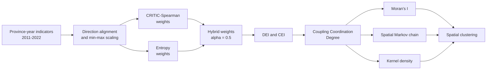

<div align="center">

# Digital Economy × Carbon Emissions

### Provincial coupling coordination, spatial dependence, and transition dynamics in China

[](https://doi.org/10.3390/su18031283)


[](LICENSE)

**English** · [简体中文](README.zh-CN.md) · [Paper PDF](paper/sustainability-18-01283.pdf) · [Published article](https://doi.org/10.3390/su18031283)

</div>

---

This repository accompanies the open-access article **“Mapping the Coupling Coordination Between China’s Digital Economy and Carbon Emissions: Spatiotemporal Patterns and Spatial Markov Transitions.”** It releases the province–year data used to construct the Digital Economy Development Index (DEI), the Carbon Emissions Index (CEI), and the Coupling Coordination Degree (CCD) for 30 provincial-level regions of China from 2011 to 2022.

The study asks a practical question: can rapid digital-economy development advance together with improved carbon-emissions performance, and how does that coordination evolve across neighboring provinces? To answer it, the paper combines objective index weighting, a coupling-coordination model, spatial autocorrelation, spatial Markov transitions, and kernel density estimation.

> **Interpretation boundary.** CCD is a synthetic diagnostic of how two systems evolve together. It is not a causal estimate of the effect of digitalization on emissions.

## At a glance

| Item | Description |
|---|---|
| Unit of analysis | Province–year |
| Spatial coverage | 30 provincial-level regions; Taiwan, Tibet, Hong Kong, and Macao are excluded because of data availability |
| Temporal coverage | 2011–2022 |
| DEI | 13 indicators covering digital infrastructure, digital industry, and digital inclusive finance |
| CEI | Carbon-emission intensity, per-capita emissions, emission density, and energy-consumption intensity |
| Weighting | CRITIC–Spearman + Entropy Weight Method, with baseline $\alpha=0.5$ |
| Spatial analysis | Global/local Moran’s $I$, spatial Markov chains, and Gaussian KDE |
| Repository contents | Raw indicator workbooks and derived DEI, CEI, and CCD workbooks |

## Research workflow



## Indicator system

### Digital Economy Development Index

All DEI variables are benefit-oriented: a larger value represents a higher level of digital-economy development.

| Dimension | Indicators in the released workbook |
|---|---|
| Digital infrastructure | Number of domains; IPv4 addresses; internet access ports; mobile-phone penetration; optical-cable length per area |
| Digital industry | IT enterprises; websites per 100 enterprises; e-commerce volume; share of firms with e-commerce activity; software revenue |
| Digital inclusive finance | Coverage breadth; usage depth; degree of digitalization |

### Carbon Emissions Index

The four source indicators are cost-oriented. They are reverse-normalized so that a larger constructed CEI denotes **better carbon-emissions performance / lower relative emissions pressure** and therefore has the same direction as DEI.

| Symbol | Indicator | Definition |
|---|---|---|
| CE | Carbon-emission intensity | Total emissions divided by GDP |
| PCCE | Per-capita carbon emissions | Total emissions divided by population |
| CED | Carbon-emission density | Total emissions divided by land area |
| ECI | Energy-consumption intensity | Energy consumption per unit of GDP |

## Methodology

### 1. Direction-aware normalization

For observation $i$ and indicator $j$:

$$
x'_{ij}=
\begin{cases}
\dfrac{x_{ij}-\min_i x_{ij}}{\max_i x_{ij}-\min_i x_{ij}}, & \text{benefit indicator},\\[8pt]
\dfrac{\max_i x_{ij}-x_{ij}}{\max_i x_{ij}-\min_i x_{ij}}, & \text{cost indicator}.
\end{cases}
$$

### 2. CRITIC–Spearman weighting

Spearman rank correlation is used because most source variables reject normality in the Shapiro–Wilk tests. For indicators $j$ and $k$:

$$
r_{jk}=1-\frac{6\sum_{i=1}^{m}d_{ijk}^{2}}{m(m^{2}-1)}.
$$

The information content and normalized CRITIC weight are

$$
I_j=\sigma_j\left(1-\frac{1}{n}\sum_{k=1}^{n}r_{jk}\right),
\qquad
w_j^{C}=\frac{I_j}{\sum_{j=1}^{n}I_j}.
$$

This rewards indicators with stronger contrast and less redundant information.

### 3. Entropy weighting and hybrid weights

$$
p_{ij}=\frac{x'_{ij}}{\sum_{i=1}^{m}x'_{ij}},
\qquad
e_j=-\frac{1}{\ln m}\sum_{i=1}^{m}p_{ij}\ln p_{ij},
\qquad
w_j^{E}=\frac{1-e_j}{\sum_{j=1}^{n}(1-e_j)}.
$$

The paper combines the two objective weights as

$$
w_j=\alpha w_j^{C}+(1-\alpha)w_j^{E},
\qquad \alpha=0.5,
$$

and constructs each composite subsystem index using

$$
U=\sum_{j=1}^{n}w_jx'_j.
$$

### 4. Coupling coordination

Let $U_1$ be DEI and $U_2$ be the direction-aligned CEI. The published specification is

$$
C=\frac{2\sqrt{U_1U_2}}{U_1+U_2},
\qquad
T=\alpha U_1+\beta U_2,
\qquad
D=\sqrt{CT},
$$

where $\alpha=\beta=0.5$. Here, $C$ is coupling, $T$ is the coordination index, and $D$ is CCD.

### 5. Spatial and distributional dynamics

Global Moran’s $I$ evaluates spatial autocorrelation:

$$
I=\frac{N}{\sum_i\sum_j w_{ij}}
\frac{\sum_i\sum_j w_{ij}(x_i-\bar{x})(x_j-\bar{x})}
{\sum_i(x_i-\bar{x})^2}.
$$

The spatial Markov transition probability from state $i$ to state $j$ is

$$
P_{ij}=\frac{N_{ij}}{N_i},
$$

and the kernel density estimate is

$$
\hat f(x)=\frac{1}{Nh}\sum_{i=1}^{N}K\!\left(\frac{x-x_i}{h}\right).
$$

The paper uses four equal-width CCD states—low, lower-middle, upper-middle, and high—and conditions transitions on local spatial association types such as H–H and L–L.

## Main findings reported in the paper

- DEI increased in most provinces, with sustained advantages in eastern and coastal regions. Beijing’s DEI rose from approximately 0.25 in 2011 to 0.74 in 2022.
- CCD improved broadly but remained spatially uneven. The paper reports Beijing moving from moderately low coordination in 2011 to high coordination in 2022, while several central and western provinces remained at lower levels.
- Global Moran’s $I$ is positive and statistically significant throughout 2011–2022, supporting persistent spatial clustering rather than a random provincial pattern.
- High-level eastern clusters show strong state persistence. Lower-level central and western provinces display greater upward-transition potential, especially toward middle coordination states.
- Sensitivity checks over $\alpha\in[0,1]$, alternative spatial-weight matrices, and perturbed state thresholds preserve the main cross-provincial pattern.
- The paper emphasizes that the eastern region combines a higher level with stronger persistence, while central and western regions contribute more to the recent “catch-up” movement of the distribution.

## Repository structure

```text
DEI-CEI/
├── README.md                                      # English documentation
├── README.zh-CN.md                                # 中文文档
├── LICENSE                                        # MIT license for repository materials
├── paper/
│   └── sustainability-18-01283.pdf               # Published article
├── 数字经济.xlsx                                  # Raw DEI indicators
├── 数字经济综合指数_CRITIC_Spearman_EWM.xlsx      # DEI indicators + derived DEI
├── 碳排放.xlsx                                    # Raw CEI indicators
├── 碳排放综合指数_CRITIC_Spearman_EWM.xlsx        # CEI indicators + derived CEI
└── 耦合协调度计算结果.xlsx                        # DEI, CEI, coupling, coordination, CCD, and regional sheets
```

## Data dictionary

| File | Granularity | Key contents |
|---|---:|---|
| `数字经济.xlsx` | 360 province–year records | IDs, province, year, and 13 DEI source indicators |
| `数字经济综合指数_CRITIC_Spearman_EWM.xlsx` | 360 records | Source indicators plus `Digital Economy Index` |
| `碳排放.xlsx` | 360 populated records | CE, PCCE, CED, and ECI source measures |
| `碳排放综合指数_CRITIC_Spearman_EWM.xlsx` | 360 records | Source measures plus `Carbon Emission Index` |
| `耦合协调度计算结果.xlsx` | 360 records + summary sheets | DEI, CEI, coupling/coordination fields, CCD, province codes, and east/central/west matrices |

The Excel workbooks preserve author-supplied formatting and auxiliary sheets. Programmatic readers should filter blank rows rather than relying only on worksheet maximum dimensions.

## Quick start

There is no executable analysis pipeline in this data-release repository. The following snippet verifies and joins the released indices without modifying the source files:

```bash
python -m pip install pandas openpyxl
```

```python
import pandas as pd

dei = pd.read_excel("数字经济综合指数_CRITIC_Spearman_EWM.xlsx")
cei = pd.read_excel("碳排放综合指数_CRITIC_Spearman_EWM.xlsx")
ccd = pd.read_excel("耦合协调度计算结果.xlsx", sheet_name="Sheet1")

key = ["ID", "年份"]
panel = (
    dei[key + ["Digital Economy Index"]]
    .merge(cei[key + ["Carbon Emission Index"]], on=key, validate="one_to_one")
)

assert len(panel) == 30 * 12
assert len(ccd.dropna(subset=["省份", "年份"])) == 30 * 12
print(panel.head())
```

## Reproducibility scope

This repository is a **data release**, not a turnkey replication package. It contains the indicator panels and derived index workbooks, but it does not currently include the scripts, provincial boundary files, spatial-weight matrices, or plotting code needed to regenerate every table and figure in the article. Use the published paper as the authoritative source for the final methodology and reported results; treat unnamed or auxiliary workbook sheets as supporting research artifacts.

## Citation

If you use these data, please cite the article and link this repository:

```bibtex
@article{gao2026mapping,
  title   = {Mapping the Coupling Coordination Between China's Digital Economy and Carbon Emissions: Spatiotemporal Patterns and Spatial Markov Transitions},
  author  = {Gao, Chen and Zhang, Chujia and Chen, Zhenlin and Wang, Yile},
  journal = {Sustainability},
  year    = {2026},
  volume  = {18},
  number  = {3},
  pages   = {1283},
  doi     = {10.3390/su18031283}
}
```

## License

Repository materials are provided under the [MIT License](LICENSE). The article PDF is an open-access publication distributed by the authors under [CC BY 4.0](https://creativecommons.org/licenses/by/4.0/); retain article attribution when redistributing it.
