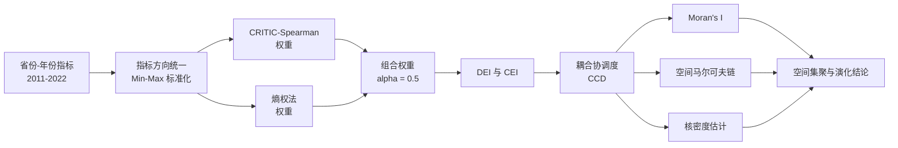

<div align="center">

# 数字经济 × 碳排放

### 中国省域耦合协调、空间依赖与状态转移研究

[](https://doi.org/10.3390/su18031283)


[](LICENSE)

[English](README.md) · **简体中文** · [论文 PDF](paper/sustainability-18-01283.pdf) · [正式发表页面](https://doi.org/10.3390/su18031283)

</div>

---

本仓库是开放获取论文 **《Mapping the Coupling Coordination Between China’s Digital Economy and Carbon Emissions: Spatiotemporal Patterns and Spatial Markov Transitions》** 的配套数据仓库，公开了 2011—2022 年中国 30 个省级地区的数字经济发展指数（DEI）、碳排放指数（CEI）和耦合协调度（CCD）相关数据。

论文关注一个现实问题：数字经济快速发展能否与更好的碳排放表现协同推进，这种协调关系又如何在相邻省份之间演化？研究依次使用客观组合赋权、耦合协调模型、空间自相关、空间马尔可夫链和核密度估计进行分析。

> **解释边界：** CCD 是两个子系统共同演化状态的综合诊断指标，不是“数字化导致碳减排”的因果效应估计。

## 项目概览

| 项目 | 内容 |
|---|---|
| 分析单元 | 省份—年份 |
| 空间范围 | 30 个省级地区；因数据可得性未纳入台湾、西藏、香港和澳门 |
| 时间范围 | 2011—2022 年 |
| DEI | 13 个指标，覆盖数字基础设施、数字产业和数字普惠金融 |
| CEI | 碳排放强度、人均碳排放、碳排放密度、能源消费强度 |
| 赋权方法 | CRITIC–Spearman 与熵权法组合，基准参数 $\alpha=0.5$ |
| 空间分析 | 全局/局部 Moran’s $I$、空间马尔可夫链、Gaussian KDE |
| 仓库内容 | 原始指标表及 DEI、CEI、CCD 结果表 |

## 研究流程



## 指标体系

### 数字经济发展指数（DEI）

DEI 的全部变量均为正向指标，数值越大表示数字经济发展水平越高。

| 维度 | 仓库中包含的指标 |
|---|---|
| 数字基础设施 | 域名数、IPv4 地址数、互联网接入端口数、移动电话普及率、单位面积光缆长度 |
| 数字产业 | 信息化企业数、每百家企业拥有网站数、电子商务交易额、有电商活动企业比重、软件业务收入 |
| 数字普惠金融 | 覆盖广度、使用深度、数字化程度 |

### 碳排放指数（CEI）

四个原始指标均为负向指标。构建指数时采用反向标准化，因此最终 CEI 越大代表 **相对碳排放压力越低、碳排放表现越好**，从而与 DEI 保持一致方向。

| 符号 | 指标 | 含义 |
|---|---|---|
| CE | 碳排放强度 | 碳排放总量与 GDP 之比 |
| PCCE | 人均碳排放 | 碳排放总量与人口之比 |
| CED | 碳排放密度 | 碳排放总量与区域面积之比 |
| ECI | 能源消费强度 | 单位 GDP 的能源消费量 |

## 方法说明

### 1. 考虑指标方向的标准化

对于第 $i$ 个观测和第 $j$ 个指标：

$$
x'_{ij}=
\begin{cases}
\dfrac{x_{ij}-\min_i x_{ij}}{\max_i x_{ij}-\min_i x_{ij}}, & \text{正向指标},\\[8pt]
\dfrac{\max_i x_{ij}-x_{ij}}{\max_i x_{ij}-\min_i x_{ij}}, & \text{负向指标}.
\end{cases}
$$

### 2. CRITIC–Spearman 赋权

由于大部分变量未通过 Shapiro–Wilk 正态性检验，论文使用 Spearman 秩相关系数衡量指标间相关性。对于指标 $j$ 和 $k$：

$$
r_{jk}=1-\frac{6\sum_{i=1}^{m}d_{ijk}^{2}}{m(m^{2}-1)}.
$$

指标信息量及 CRITIC 权重为：

$$
I_j=\sigma_j\left(1-\frac{1}{n}\sum_{k=1}^{n}r_{jk}\right),
\qquad
w_j^{C}=\frac{I_j}{\sum_{j=1}^{n}I_j}.
$$

该方法同时考虑指标的差异性与信息冗余程度。

### 3. 熵权法与组合权重

$$
p_{ij}=\frac{x'_{ij}}{\sum_{i=1}^{m}x'_{ij}},
\qquad
e_j=-\frac{1}{\ln m}\sum_{i=1}^{m}p_{ij}\ln p_{ij},
\qquad
w_j^{E}=\frac{1-e_j}{\sum_{j=1}^{n}(1-e_j)}.
$$

论文将两类客观权重组合为：

$$
w_j=\alpha w_j^{C}+(1-\alpha)w_j^{E},
\qquad \alpha=0.5,
$$

并使用加权和构建子系统综合指数：

$$
U=\sum_{j=1}^{n}w_jx'_j.
$$

### 4. 耦合协调度

令 $U_1$ 为 DEI，$U_2$ 为方向统一后的 CEI，论文采用：

$$
C=\frac{2\sqrt{U_1U_2}}{U_1+U_2},
\qquad
T=\alpha U_1+\beta U_2,
\qquad
D=\sqrt{CT},
$$

其中 $\alpha=\beta=0.5$，$C$ 表示耦合度，$T$ 表示协调指数，$D$ 表示耦合协调度。

### 5. 空间与分布动态

全局 Moran’s $I$ 用于检验空间自相关：

$$
I=\frac{N}{\sum_i\sum_j w_{ij}}
\frac{\sum_i\sum_j w_{ij}(x_i-\bar{x})(x_j-\bar{x})}
{\sum_i(x_i-\bar{x})^2}.
$$

空间马尔可夫状态转移概率为：

$$
P_{ij}=\frac{N_{ij}}{N_i},
$$

核密度估计为：

$$
\hat f(x)=\frac{1}{Nh}\sum_{i=1}^{N}K\!\left(\frac{x-x_i}{h}\right).
$$

论文将 CCD 等距划分为低、中低、中高、高四种状态，并结合 H–H、L–L 等局部空间关联类型分析条件转移。

## 论文主要发现

- 大多数省份的 DEI 持续提升，东部沿海地区保持明显优势；北京 DEI 由 2011 年约 0.25 上升至 2022 年约 0.74。
- 全国 CCD 总体改善，但空间差异显著。论文报告北京由 2011 年的中低协调阶段上升到 2022 年的高协调阶段，部分中西部省份仍处于较低水平。
- 2011—2022 年全局 Moran’s $I$ 均为正且具有统计显著性，说明省域 CCD 长期存在空间集聚，而非随机分布。
- 东部高水平集聚区具有较强的状态持续性；中西部低水平地区向中间状态升级的潜力更明显。
- 在 $\alpha\in[0,1]$、替代空间权重矩阵和状态阈值扰动下，主要省际格局保持稳定。
- 东部表现为“较高水平 + 较强锁定”，中西部则是近年总体分布向右移动和追赶的主要来源。

## 仓库结构

```text
DEI-CEI/
├── README.md                                      # English documentation
├── README.zh-CN.md                                # 中文说明
├── LICENSE                                        # 仓库 MIT 许可
├── paper/
│   └── sustainability-18-01283.pdf               # 正式发表论文
├── 数字经济.xlsx                                  # DEI 原始指标
├── 数字经济综合指数_CRITIC_Spearman_EWM.xlsx      # DEI 原始指标 + 综合指数
├── 碳排放.xlsx                                    # CEI 原始指标
├── 碳排放综合指数_CRITIC_Spearman_EWM.xlsx        # CEI 原始指标 + 综合指数
└── 耦合协调度计算结果.xlsx                        # DEI、CEI、CCD 与分区域结果
```

## 数据文件说明

| 文件 | 数据粒度 | 主要内容 |
|---|---:|---|
| `数字经济.xlsx` | 360 条省份—年份记录 | ID、省份、年份与 13 个 DEI 原始指标 |
| `数字经济综合指数_CRITIC_Spearman_EWM.xlsx` | 360 条 | 原始指标及 `Digital Economy Index` |
| `碳排放.xlsx` | 360 条有效记录 | CE、PCCE、CED、ECI |
| `碳排放综合指数_CRITIC_Spearman_EWM.xlsx` | 360 条 | 原始指标及 `Carbon Emission Index` |
| `耦合协调度计算结果.xlsx` | 360 条 + 汇总工作表 | DEI、CEI、耦合/协调字段、CCD、省份代码及东中西部矩阵 |

Excel 文件保留了作者提供的格式和辅助工作表。程序读取时应过滤空行，不要仅根据 Excel 的最大行号判断样本量。

## 快速读取

本仓库目前是数据发布仓库，没有统一的可执行分析流水线。下面的示例可在不修改源文件的情况下检查并合并两个指数：

```bash
python -m pip install pandas openpyxl
```

```python
import pandas as pd

dei = pd.read_excel("数字经济综合指数_CRITIC_Spearman_EWM.xlsx")
cei = pd.read_excel("碳排放综合指数_CRITIC_Spearman_EWM.xlsx")
ccd = pd.read_excel("耦合协调度计算结果.xlsx", sheet_name="Sheet1")

key = ["ID", "年份"]
panel = (
    dei[key + ["Digital Economy Index"]]
    .merge(cei[key + ["Carbon Emission Index"]], on=key, validate="one_to_one")
)

assert len(panel) == 30 * 12
assert len(ccd.dropna(subset=["省份", "年份"])) == 30 * 12
print(panel.head())
```

## 可复现范围

本仓库属于 **数据发布包**，并非一键复现项目。目前已公开原始指标表和综合指数结果表，但尚未包含生成论文全部表格与图形所需的分析脚本、省界文件、空间权重矩阵和绘图代码。最终方法与正式结果应以已发表论文为准；未命名或辅助工作表应视为研究过程产物。

## 引用方式

使用本仓库数据时，请引用论文并附上仓库链接：

```bibtex
@article{gao2026mapping,
  title   = {Mapping the Coupling Coordination Between China's Digital Economy and Carbon Emissions: Spatiotemporal Patterns and Spatial Markov Transitions},
  author  = {Gao, Chen and Zhang, Chujia and Chen, Zhenlin and Wang, Yile},
  journal = {Sustainability},
  year    = {2026},
  volume  = {18},
  number  = {3},
  pages   = {1283},
  doi     = {10.3390/su18031283}
}
```

## 许可

仓库材料使用 [MIT License](LICENSE)。论文 PDF 是作者以 [CC BY 4.0](https://creativecommons.org/licenses/by/4.0/) 发布的开放获取作品；再次分发时请保留完整论文署名。
