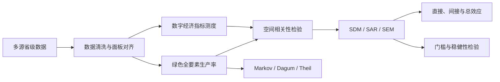

<p align="center">
  
</p>

<h1 align="center">数字经济与区域绿色全要素生产率</h1>

<p align="center">
  面向中国省级面板研究的数据集合与空间计量工具箱
  <br>
  <sub>Provincial panel data, spatial econometrics, and reproducible research materials</sub>
</p>

<p align="center">
  
  
  
  
  
</p>

<p align="center">
  <a href="#项目概览">项目概览</a> ·
  <a href="#研究框架">研究框架</a> ·
  <a href="#数据资产">数据资产</a> ·
  <a href="#快速开始">快速开始</a> ·
  <a href="#复现状态">复现状态</a> ·
  <a href="./docs/DATA_CATALOG.md">数据字典</a>
</p>

---

## 项目概览

本仓库围绕“数字经济如何影响区域绿色全要素生产率”这一主题，汇集了省级数字经济指标、绿色全要素生产率、常用控制变量、空间权重矩阵，以及 Stata / MATLAB 计量分析模板。它适合用于论文选题验证、面板数据整理、空间溢出效应分析和稳健性拓展。

<table>
  <tr>
    <td align="center"><strong>1990–2023</strong><br><sub>最长数据跨度</sub></td>
    <td align="center"><strong>31 个地区</strong><br><sub>多数省级面板</sub></td>
    <td align="center"><strong>30 × 13</strong><br><sub>GTFP 地区 × 年份</sub></td>
    <td align="center"><strong>6 类方法</strong><br><sub>测度、空间与动态分析</sub></td>
  </tr>
</table>

> [!IMPORTANT]
> 当前版本定位为**研究资料与方法工具箱**，不是开箱即用的一键复现包。正式估计前，需要统一省份编码和年份口径，替换示例脚本中的本地路径与占位变量，并核对原始数据的来源、授权和计算方法。

## 研究框架



仓库提供的材料可以支撑以下分析路径：

- **综合测度**：熵值法、Malmquist–Luenberger 指数及累乘绿色全要素生产率；
- **空间识别**：全局 / 局部 Moran's I、邻接矩阵、地理距离矩阵和经济地理矩阵；
- **空间估计**：空间杜宾模型（SDM），并通过 LM、LR、Wald、Hausman 检验辅助模型选择；
- **动态演进**：传统与空间 Markov 链，可按 3、4、5 类状态划分；
- **差异分解**：Dagum 基尼系数、Theil 指数与三维核密度材料；
- **非线性拓展**：面板门槛模型及似然比曲线绘图。

## 数据资产

### 核心变量

| 研究角色 | 数据模块 | 当前覆盖 | 主要内容 |
|---|---|---:|---|
| 核心解释变量 | [`2023数字经济专利/`](./2023数字经济专利/) | 31 地区，2000–2023 | 数字经济相关发明与实用新型的申请、授权数量 |
| 数字化拓展指标 | [`数字服务贸易/`](./数字服务贸易/) | 31 地区，1990–2022 | 数字贸易指数、ICT 产品与服务出口相关指标 |
| 被解释变量 | [`绿色全要素生产率/`](./绿色全要素生产率/) | 30 地区，2011–2023 | 劳动、资本、能源投入，GDP 期望产出，污染非期望产出与 ML 指数 |
| 生产率对照 | [`全要素生产率/`](./全要素生产率/) | 文件标注 1990–2023 | 省级全要素生产率 |
| 综合控制变量 | [`常用的控制变量/`](./常用的控制变量/) | 31 地区，2000–2023 | 税负、财政、发展、消费、产业、城镇化、收入差距、人口密度与金融指标 |

### 扩展变量与方法

| 类型 | 仓库内容 |
|---|---|
| 区域发展 | [`2023城镇化率/`](./2023城镇化率/)、[`2023市场化指数/`](./2023市场化指数/)、[`产业结构/`](./产业结构/) |
| 技术与产业 | [`工业机器人安装密度_20250520_153101/`](./工业机器人安装密度_20250520_153101/)、[`战略性新兴产业收入/`](./战略性新兴产业收入/) |
| 政府与金融 | [`政府干预程度_20250521_164937/`](./政府干预程度_20250521_164937/)、[`金融发展水平_20250521_174254/`](./金融发展水平_20250521_174254/) |
| 绿色与分配 | [`碳排放总量/`](./碳排放总量/)、[`泰尔指数/`](./泰尔指数/) |
| 空间计量 | [`空间矩阵/`](./空间矩阵/)、[`空间杜宾模型/`](./空间杜宾模型/)、[`空间计量模型相关命令/`](./空间计量模型相关命令/) |
| 动态与差异 | [`04-Markov链/`](./04-Markov链/)、[`Dagum基尼系数/`](./Dagum基尼系数/)、[`熵值法/`](./熵值法/) |

完整的观测数、字段、时间跨度与使用提示见 **[数据目录与口径说明](./docs/DATA_CATALOG.md)**。

## 仓库结构

```text
.
├── 2023数字经济专利/          # 数字经济相关专利省级面板
├── 数字服务贸易/              # 数字贸易指数及分项
├── 绿色全要素生产率/          # ML 指数、投入与产出数据
├── 常用的控制变量/            # 2000–2023 综合控制变量面板
├── 产业结构/                  # 产业、能源和环保支出数据
├── 空间矩阵/                  # 邻接、地理及经济地理权重矩阵
├── 空间杜宾模型/              # SDM 示例数据、矩阵与 Stata 脚本
├── 04-Markov链/               # 3/4/5 状态 Markov MATLAB 模板
├── 熵值法/                    # 熵权法 Stata 示例
├── 门槛效应绘图代码/          # 面板门槛与 LR 曲线模板
├── Stata命令大全/             # 通用实证命令参考
├── docs/                      # 数据口径与使用文档
└── assets/                    # README 视觉资源
```

## 快速开始

### 1. 获取仓库

```bash
git clone https://github.com/KarlHeinrich-jpg/Digital-Economy-on-Regional-Green-Total-Factor-Productivity.git
cd Digital-Economy-on-Regional-Green-Total-Factor-Productivity
```

仓库包含较大的表格、文档和视频文件，首次克隆可能需要一些时间。

### 2. 先统一面板键

建议在合并前建立一致的主键，并保留一份省份映射表：

```text
province_code   province_name   year
110000          北京市          2000
120000          天津市          2000
...             ...             ...
```

重点检查省份后缀（“北京”与“北京市”）、年份格式（`2010` 与 `2010年`）、西藏是否纳入，以及空间矩阵中的地区顺序是否与面板排序完全一致。

### 3. 运行空间计量模板

安装脚本所需的 Stata 扩展命令后，复制模板并替换工作路径、变量名和矩阵名。最小流程示意：

```stata
use "your_panel.dta", clear
xtset id year

spatwmat using "your_weight_matrix.dta", name(W) standardize
spatgsa y, weights(W) moran twotail

xsmle y x1 x2 x3 x4, fe model(sdm) wmat(W) type(both) effects
```

可参考 [`空间杜宾完整思路do文件.do`](./空间杜宾模型/更新空间杜宾实证代码/空间杜宾完整思路do文件.do) 完成 Moran's I、LM、Wald、LR、Hausman 检验与效应分解。示例中的 `data1`、`W2`、`y`、`x1...x7` 均为占位名称。

### 4. 运行 Markov 分析

进入 [`04-Markov链/`](./04-Markov链/) 下的 `3类`、`4类` 或 `5类` 文件夹：

1. 在 `data.xlsx` 的 `Sheet1` 放入“地区 × 年份”指标矩阵；
2. 在 `Sheet2` 放入与地区顺序一致的 `n × n` 空间权重矩阵；
3. 在 MATLAB 中将当前工作目录切换到相应文件夹；
4. 运行 `Markov.m`，在变量 `jieguo` 中查看传统与空间 Markov 转移结果。

脚本默认滞后期 `tt = 1`，分类阈值采用分位数，可按研究设计修改。

## 软件与环境

| 工具 | 用途 | 说明 |
|---|---|---|
| Stata | 面板、空间计量、门槛与熵值法 | 示例材料涉及 Stata 14/16；兼容性取决于本地扩展包版本 |
| MATLAB | 传统与空间 Markov 链 | 使用 `.m` 脚本与 Excel 输入文件 |
| Excel / LibreOffice | 数据浏览与初步整理 | 建议另存副本后清洗，保留原始数据不变 |

Stata 模板涉及 `xsmle`、`spatwmat`、`spatgsa`、`spatlsa`、`spcs2xt`、`spatdiag`、`xthreg`、`esttab`、`outreg2`、`logout` 等命令。请根据所用 Stata 版本查阅对应包的安装与引用说明。

## 复现状态

| 组件 | 状态 | 备注 |
|---|:---:|---|
| 原始 / 整理后数据 | ✅ | 已按主题目录收录，覆盖范围因指标而异 |
| 空间权重矩阵 | ✅ | 包含邻接、地理距离与经济地理等口径 |
| 方法示例脚本 | ✅ | Stata 与 MATLAB 模板可供改写 |
| 统一变量字典 | 🟡 | 本 README 与数据目录提供第一版说明 |
| 一键主脚本 | ⏳ | 尚未提供从清洗到出表的 `master.do` |
| 最终回归结果 | ⏳ | 仓库未提供可核验的主回归表与日志 |
| 开源许可证 | ⚠️ | 当前未声明，使用前请联系维护者并核对第三方授权 |

## 数据质量与使用提醒

> [!WARNING]
> 研究结论应建立在重新清洗、核验和复现的基础上，不应直接把示例材料中的结果视为本项目结论。

- 仓库中大量带 `(1)` 的文件与未编号文件是字节级重复副本；分析时建议优先选取未编号版本并记录校验值；
- 多数省级面板包含 31 个地区，而绿色全要素生产率当前包含 30 个地区，合并时需明确样本边界；
- 市场化指数脚本使用历史平均增长率补齐 2020–2023 年，属于推算值，应在论文中披露并进行稳健性检验；
- 部分脚本包含 Windows 绝对路径、示例变量名和固定年份，运行前必须逐项替换；
- 数据与材料来自多个第三方渠道，文件名或说明中可见众鲤数据网、萌萌数据屋、小泽智慧馆及相关论文等来源；正式使用时请回溯原始出处并遵守授权要求；
- 当前仓库没有 `LICENSE`。公开可见不等于允许复制、再分发或商用。

## 引用建议

使用本仓库时，请同时引用具体指标的**原始数据来源**与所采用方法的**原始文献**。仓库本身可暂按以下形式引用：

```bibtex
@misc{karlheinrich2026digitalgreen,
  author       = {KarlHeinrich-jpg},
  title        = {Digital Economy on Regional Green Total Factor Productivity},
  year         = {2026},
  howpublished = {GitHub repository},
  url          = {https://github.com/KarlHeinrich-jpg/Digital-Economy-on-Regional-Green-Total-Factor-Productivity}
}
```

## 贡献

欢迎通过 Issue 或 Pull Request 补充数据来源、统一变量口径、修正脚本路径、增加可复现日志，或提交从数据清洗到结果导出的完整工作流。提交数据时请注明来源、时间范围、单位、缺失值处理方式和授权情况。

---

<p align="center">
  <sub>让数据口径可追溯，让空间效应可解释，让实证过程可复现。</sub>
</p>
