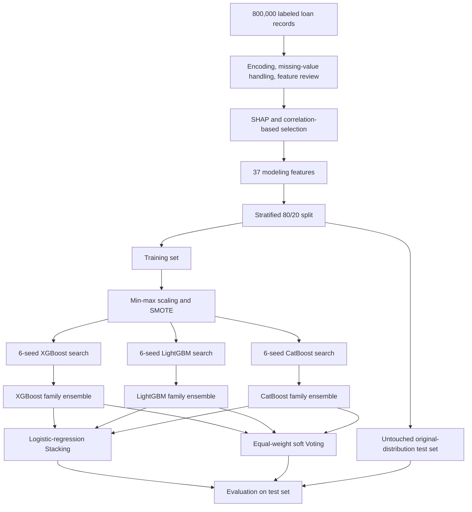

<div align="center">

# Credit Default Risk Assessment with a Stacking Ensemble

### A two-level ensemble for large-scale, imbalanced personal-loan data

[](#repository-status)
[](#dataset)
[](#model-architecture)
[](#model-architecture)

**English** · [简体中文](README.zh-CN.md)

[Read the manuscript](paper/credit-default-risk-stacking-ensemble.docx) · [Dataset source](https://tianchi.aliyun.com/competition/entrance/531879/information) · [Framework slides](Model_Framework.pptx)

</div>

---

## Overview

This repository accompanies the manuscript **“Research on Credit Default Risk Assessment Based on a Stacking Ensemble Model.”** The study develops a two-level ensemble-learning framework for identifying loan defaults in a large, high-dimensional, and imbalanced credit dataset.

The framework combines three gradient-boosting model families—XGBoost, LightGBM, and CatBoost—in two stages. Multiple random-search runs stabilize each model family through intra-model soft voting; a logistic-regression meta-classifier then learns how to combine the three family-level ensembles. Equal-weight soft voting is retained as a comparison.

> [!IMPORTANT]
> This is currently a **research-material archive**, not a turnkey reproduction package. The manuscript and editable framework diagrams are available, but the training script, processed data, fitted models, and frozen environment are not included. Reported values below come from the supplied manuscript and its embedded run log.

## At a glance

| Item | Description |
|---|---|
| Task | Binary personal-loan default prediction |
| Dataset | 2023 Alibaba Cloud Tianchi competition data |
| Study sample | 800,000 labeled loan records |
| Original input | 46 predictors plus `isDefault` |
| Modeling input | 37 selected predictors; 38 columns including the label |
| Default prevalence | 19.95% |
| Split | Stratified 80/20 train-test split |
| Base learners | XGBoost, LightGBM, CatBoost |
| Optimization | 6 random seeds × randomized search × 3-fold stratified CV |
| Intra-model fusion | Mean predicted probabilities across six seed-specific estimators |
| Inter-model fusion | Logistic-regression Stacking; soft Voting as comparator |
| Primary risk-oriented result | Stacking: default-class recall 0.2399 and F1 0.3217 |

## Research motivation

Overall accuracy can be misleading when roughly four out of five observations are non-defaults. A credit-risk model may achieve a high accuracy by favoring the majority class while missing borrowers who actually default. The study therefore evaluates both global discrimination and minority-class detection.

Its main contributions are:

1. **Multi-seed robust optimization** to reduce dependence on one randomized hyperparameter search.
2. **Intra-model soft voting** to stabilize each boosting family before heterogeneous fusion.
3. **Inter-model Stacking** to learn a non-uniform combination of the three family ensembles.
4. **Risk-oriented evaluation** emphasizing default-class recall and F1 alongside accuracy and ROC-AUC.
5. **Ablation analysis** separating the contributions of SMOTE, multi-seed optimization, and Stacking.

## Study workflow



## Dataset

The manuscript uses the labeled training portion of the Alibaba Cloud Tianchi loan-default competition. The official competition page describes anonymized credit-platform records and uses `isDefault` as the binary target. Access may require a Tianchi account and acceptance of the competition terms; the dataset is therefore **not redistributed in this repository**.

| Split statistic | Value |
|---|---:|
| Total observations | 800,000 |
| Non-default observations | 640,390 |
| Default observations | 159,610 |
| Training observations | 640,000 |
| Test observations | 160,000 |
| Training default observations before SMOTE | 127,688 |
| Training observations per class after SMOTE | 512,312 |

The features cover loan terms, income and indebtedness, credit history, housing and verification status, loan purpose, regional codes, and 15 anonymized behavioral variables (`n0`–`n14`). Date variables are transformed relative to 2024-06-01, ordinal categories are label-encoded, and nominal categories are one-hot encoded.

Feature screening combines random-forest SHAP importance, correlation with the target, and pairwise redundancy checks. Pairs with absolute correlation above 0.9 are reviewed, retaining the variable with stronger contribution or clearer interpretation. The manuscript reports a reduction from 46 original predictors to 37 modeling features.

## Model architecture

### 1. Gradient-boosting base learners

For a boosting iteration $t$, the prediction is updated by adding a new tree $f_t$:

$$
\hat{y}_i^{(t)} = \hat{y}_i^{(t-1)} + f_t(x_i).
$$

For XGBoost, the regularized stage-wise objective can be summarized as:

$$
\mathcal{L}^{(t)} = \sum_{i=1}^{n} \ell\!\left(y_i,\hat{y}_i^{(t-1)}+f_t(x_i)\right)+\Omega(f_t).
$$

XGBoost contributes explicit regularization, LightGBM provides efficient histogram-based leaf-wise growth, and CatBoost adds ordered boosting and robust categorical-feature handling.

### 2. Multi-seed search and intra-model fusion

For each model family, randomized search is repeated with $S=6$ seeds, using three-fold stratified cross-validation and ROC-AUC as the selection score. The family-level probability is the arithmetic mean of the six selected estimators:

$$
\bar{p}_m(y=c\mid x)=\frac{1}{S}\sum_{s=1}^{S}p_{m,s}(y=c\mid x), \qquad S=6.
$$

This yields XGBoost-Ensemble, LightGBM-Ensemble, and CatBoost-Ensemble.

### 3. Stacking meta-learner

The three binary probability vectors are concatenated into a six-dimensional meta-feature:

$$
z(x)=\bar{h}_{XGB}(x)\oplus\bar{h}_{LGBM}(x)\oplus\bar{h}_{CAT}(x)\in\mathbb{R}^{6}.
$$

A logistic-regression meta-classifier then estimates default probability:

$$
P(y=1\mid x)=\sigma\!\left(w^{\top}z(x)+b\right)
=\frac{1}{1+\exp\!\left[-\left(w^{\top}z(x)+b\right)\right]}.
$$

The comparator is equal-weight inter-model soft voting:

$$
p_{\text{vote}}(y=c\mid x)=\frac{1}{3}\sum_{m=1}^{3}\bar{p}_m(y=c\mid x).
$$

### 4. Scaling and evaluation

Min-max scaling is defined as:

$$
x_j'=\frac{x_j-x_j^{\min}}{x_j^{\max}-x_j^{\min}}.
$$

The manuscript reports fitting the scaling parameters on the training set and retaining the original class distribution in the test set. For the default class, the central metrics are:

$$
\operatorname{Recall}_{1}=\frac{TP}{TP+FN}, \qquad
F1_{1}=2\cdot\frac{\operatorname{Precision}_{1}\operatorname{Recall}_{1}}
{\operatorname{Precision}_{1}+\operatorname{Recall}_{1}}.
$$

## Main results

Results are reported on the 160,000-record original-distribution test set.

| Model | Accuracy | Macro Recall | Macro F1 | ROC-AUC | Recall (default) | F1 (default) |
|---|---:|---:|---:|---:|---:|---:|
| XGBoost Ensemble | 0.8056 | 0.5483 | 0.5435 | 0.7258 | 0.1200 | 0.1977 |
| LightGBM Ensemble | **0.8062** | 0.5468 | 0.5408 | **0.7283** | 0.1152 | 0.1918 |
| CatBoost Ensemble | 0.8053 | 0.5408 | 0.5303 | 0.7251 | 0.1007 | 0.1710 |
| **Stacking** | 0.7982 | **0.5886** | **0.6016** | 0.7274 | **0.2399** | **0.3217** |
| Soft Voting | 0.8061 | 0.5453 | 0.5383 | 0.7274 | 0.1115 | 0.1866 |

LightGBM-Ensemble produces the best overall accuracy and AUC. Stacking accepts a small reduction in accuracy while approximately doubling default recall relative to the three family ensembles. This is the manuscript's principal operational trade-off: stronger identification of risky borrowers at the cost of more false positives.

### Ablation study

| Configuration | Accuracy | ROC-AUC | Recall (default) | F1 (default) |
|---|---:|---:|---:|---:|
| Full framework | 0.7982 | 0.7274 | 0.2399 | 0.3217 |
| Without SMOTE | 0.8010 | 0.7191 | 0.1908 | 0.2767 |
| Without multi-seed optimization | 0.7976 | 0.7259 | 0.2361 | 0.3176 |
| Replace Stacking with Voting | 0.8061 | 0.7274 | 0.1115 | 0.1866 |

The ablations attribute the largest minority-class gains to SMOTE and the learned Stacking layer. Multi-seed optimization provides a smaller performance change and is primarily presented as a stability mechanism.

> [!CAUTION]
> These are experimental classification results, not a production lending policy. Real deployment requires probability calibration, threshold selection based on asymmetric costs, fairness and drift audits, regulatory review, and human oversight.

## Repository structure

```text
.
├── README.md
├── README.zh-CN.md
├── Model_Framework.pptx
├── 思路.vsdx
├── paper/
│   └── credit-default-risk-stacking-ensemble.docx
└── .gitattributes
```

| Path | Purpose |
|---|---|
| `README.md` | English project guide |
| `README.zh-CN.md` | Chinese project guide |
| `paper/credit-default-risk-stacking-ensemble.docx` | Full supplied manuscript, including figures, tables, references, and run log |
| `Model_Framework.pptx` | Editable English model-framework slide |
| `思路.vsdx` | Editable Chinese workflow and feature-screening notes |

## Repository status

| Reproducibility asset | Availability |
|---|---|
| Full manuscript | Available |
| Editable model-framework diagram | Available |
| Research-planning diagram | Available |
| Raw competition data | Not redistributed; obtain from Tianchi |
| Preprocessed 37-feature dataset | Not included |
| Training and evaluation source code | Not included |
| Trained model artifacts | Not included |
| Frozen dependency versions | Not included |

The manuscript describes IQR-based outlier filtering, while the editable Visio planning note says that outliers were visualized but retained because of the sample size. Without the final training script, this discrepancy cannot be audited. Treat the manuscript as the source for reported findings, and document the implemented choice when reproducing the experiment.

The reported software stack implies Python with `pandas`, `numpy`, `scikit-learn`, `imbalanced-learn`, `xgboost`, `lightgbm`, `catboost`, `shap`, `matplotlib`, `seaborn`, and `joblib`; exact versions are not specified.

### Recommended reproduction discipline

For a future code release, a leakage-resistant experiment should:

1. create the stratified holdout before learning any data-dependent transform;
2. fit imputation, encoding, feature selection, scaling, and SMOTE only on training folds;
3. generate out-of-fold base-model probabilities for the Stacking meta-learner;
4. tune thresholds on validation data rather than the final test set; and
5. evaluate once on the untouched, original-distribution holdout.

## Citation

The supplied manuscript does not include a public author list, venue, DOI, or final bibliographic record. Until publication metadata is available, cite the project as a repository resource:

```bibtex
@misc{credit_default_stacking_repository,
  title        = {Research on Credit Default Risk Assessment Based on a Stacking Ensemble Model},
  howpublished = {GitHub repository and accompanying manuscript},
  url          = {https://github.com/KarlHeinrich-jpg/Research-on-Credit-Default-Risk-Assessment-Based-on-a-Stacking-Ensemble-Model},
  note         = {Accessed 2026-08-28}
}
```

## License and use

No repository-wide license is currently declared. Unless the rights holder adds one, the manuscript, diagrams, and other repository contents should not be assumed to permit redistribution, modification, or commercial reuse. The Tianchi dataset remains subject to its own access and competition terms.
