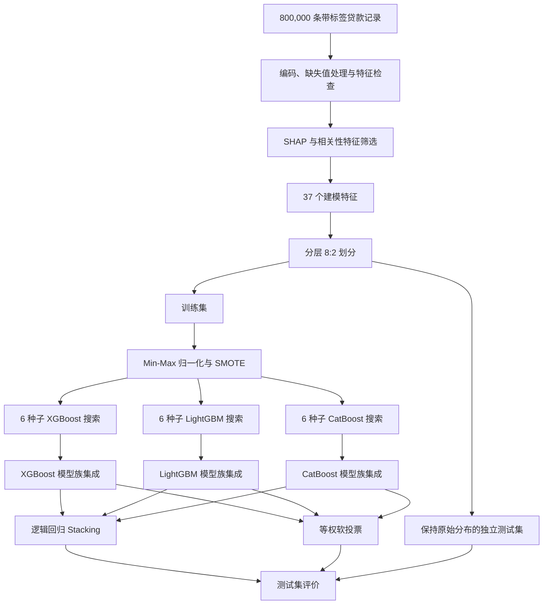

<div align="center">

# 基于 Stacking 融合模型的信贷违约风险评估

### 面向大规模类别不平衡个人信贷数据的两层级集成框架

[](#仓库现状)
[](#数据集)
[](#模型架构)
[](#模型架构)

[English](README.md) · **简体中文**

[阅读论文](paper/credit-default-risk-stacking-ensemble.docx) · [数据集来源](https://tianchi.aliyun.com/competition/entrance/531879/information) · [模型框架幻灯片](Model_Framework.pptx)

</div>

---

## 项目概述

本仓库是论文《基于 Stacking 融合模型的信贷违约风险评估研究》的配套项目。研究面向大规模、高维且类别不平衡的个人信贷数据，提出了一套用于识别贷款违约风险的两层级集成学习框架。

框架首先对 XGBoost、LightGBM 和 CatBoost 分别开展多随机种子超参数搜索，并在同一模型族内部对最优估计器进行软投票；随后，以三个模型族集成器输出的概率作为元特征，使用逻辑回归完成模型间 Stacking，同时将等权软投票作为对照方法。

> [!IMPORTANT]
> 当前仓库属于**研究资料归档**，还不是可一键运行的完整复现包。仓库已经提供论文全文和可编辑框架图，但尚未公开训练脚本、处理后数据、训练模型和锁定版本的运行环境。下文数值来自所提供论文及论文内附的运行日志。

## 核心信息

| 项目 | 内容 |
|---|---|
| 研究任务 | 个人贷款违约二分类预测 |
| 数据来源 | 2023 年阿里云天池贷款违约竞赛数据 |
| 研究样本 | 800,000 条带标签贷款记录 |
| 原始输入 | 46 个特征及目标变量 `isDefault` |
| 建模输入 | 筛选后 37 个特征；含标签共 38 列 |
| 违约样本占比 | 19.95% |
| 数据划分 | 分层抽样的 8:2 训练集—测试集 |
| 基学习器 | XGBoost、LightGBM、CatBoost |
| 参数优化 | 6 个随机种子 × 随机搜索 × 3 折分层交叉验证 |
| 模型内融合 | 对 6 个种子最优估计器的预测概率取均值 |
| 模型间融合 | 逻辑回归 Stacking；软投票作为对照 |
| 主要风控结果 | Stacking 的违约类 Recall 为 0.2399、F1 为 0.3217 |

## 研究动机与贡献

当约五分之四的样本属于非违约类时，仅看 Accuracy 很容易产生误导：模型即使偏向多数类、漏掉大量真实违约借款人，也可能获得较高准确率。因此，本文同时考察全局区分能力与少数类识别能力。

主要贡献包括：

1. **多种子稳健优化**：降低单次随机参数搜索所带来的偶然性。
2. **模型内软投票**：在异构融合前先稳定每一个梯度提升模型族。
3. **模型间 Stacking**：学习三个模型族的非等权组合关系。
4. **面向风险的评价体系**：在 Accuracy 和 ROC-AUC 之外重点关注违约类 Recall 与 F1。
5. **消融实验**：分别检验 SMOTE、多种子优化和 Stacking 元学习的作用。

## 研究流程



## 数据集

论文使用阿里云天池贷款违约竞赛的带标签训练数据。竞赛官方页面将任务定义为基于脱敏信贷平台记录预测二分类目标 `isDefault`。数据下载可能要求登录天池并接受竞赛条款，因此本仓库**不重新分发原始数据**。

| 划分统计 | 数值 |
|---|---:|
| 总样本数 | 800,000 |
| 非违约样本 | 640,390 |
| 违约样本 | 159,610 |
| 训练集样本 | 640,000 |
| 测试集样本 | 160,000 |
| SMOTE 前训练集违约样本 | 127,688 |
| SMOTE 后训练集每类样本 | 512,312 |

原始变量覆盖贷款条件、收入与负债、信用历史、住房与验证状态、贷款用途、区域编码，以及 15 个匿名行为特征（`n0`–`n14`）。日期变量以 2024-06-01 为基准转化为时间间隔；有序类别采用标签编码，无序类别采用独热编码。

特征筛选综合随机森林 SHAP 重要度、变量与目标的相关性以及特征间冗余度。对于绝对相关系数大于 0.9 的变量对，优先保留贡献更高或经济含义更清晰的变量。论文报告最终将 46 个原始特征精简为 37 个建模特征。

## 模型架构

### 1. 梯度提升基学习器

在第 $t$ 轮迭代中，模型在已有预测的基础上增加一棵新树 $f_t$：

$$
\hat{y}_i^{(t)} = \hat{y}_i^{(t-1)} + f_t(x_i).
$$

以 XGBoost 为例，其带正则项的阶段目标可以概括为：

$$
\mathcal{L}^{(t)} = \sum_{i=1}^{n} \ell\!\left(y_i,\hat{y}_i^{(t-1)}+f_t(x_i)\right)+\Omega(f_t).
$$

XGBoost 提供显式正则化，LightGBM 通过直方图与叶子优先生长提高大样本训练效率，CatBoost 则利用有序提升等机制改善类别特征处理和预测偏移问题。

### 2. 多种子搜索与模型内融合

每个模型族使用 $S=6$ 个随机种子重复随机参数搜索，以三折分层交叉验证和 ROC-AUC 选择最优估计器。模型族的最终预测概率为六个估计器的算术平均：

$$
\bar{p}_m(y=c\mid x)=\frac{1}{S}\sum_{s=1}^{S}p_{m,s}(y=c\mid x), \qquad S=6.
$$

由此分别得到 XGBoost-Ensemble、LightGBM-Ensemble 和 CatBoost-Ensemble。

### 3. Stacking 元学习器

将三个模型族输出的二分类概率向量拼接为六维元特征：

$$
z(x)=\bar{h}_{XGB}(x)\oplus\bar{h}_{LGBM}(x)\oplus\bar{h}_{CAT}(x)\in\mathbb{R}^{6}.
$$

逻辑回归元分类器据此计算违约概率：

$$
P(y=1\mid x)=\sigma\!\left(w^{\top}z(x)+b\right)
=\frac{1}{1+\exp\!\left[-\left(w^{\top}z(x)+b\right)\right]}.
$$

作为对照，模型间等权软投票定义为：

$$
p_{\text{vote}}(y=c\mid x)=\frac{1}{3}\sum_{m=1}^{3}\bar{p}_m(y=c\mid x).
$$

### 4. 归一化与评价指标

Min-Max 归一化公式为：

$$
x_j'=\frac{x_j-x_j^{\min}}{x_j^{\max}-x_j^{\min}}.
$$

论文说明归一化参数只在训练集上估计，测试集保持原始类别分布。对于违约类，最关键的评价指标为：

$$
\operatorname{Recall}_{1}=\frac{TP}{TP+FN}, \qquad
F1_{1}=2\cdot\frac{\operatorname{Precision}_{1}\operatorname{Recall}_{1}}
{\operatorname{Precision}_{1}+\operatorname{Recall}_{1}}.
$$

## 主要结果

下表为 160,000 条原始分布测试样本上的结果。

| 模型 | Accuracy | Macro Recall | Macro F1 | ROC-AUC | 违约类 Recall | 违约类 F1 |
|---|---:|---:|---:|---:|---:|---:|
| XGBoost Ensemble | 0.8056 | 0.5483 | 0.5435 | 0.7258 | 0.1200 | 0.1977 |
| LightGBM Ensemble | **0.8062** | 0.5468 | 0.5408 | **0.7283** | 0.1152 | 0.1918 |
| CatBoost Ensemble | 0.8053 | 0.5408 | 0.5303 | 0.7251 | 0.1007 | 0.1710 |
| **Stacking** | 0.7982 | **0.5886** | **0.6016** | 0.7274 | **0.2399** | **0.3217** |
| 软投票 | 0.8061 | 0.5453 | 0.5383 | 0.7274 | 0.1115 | 0.1866 |

LightGBM-Ensemble 获得最高的总体 Accuracy 和 AUC；Stacking 则接受小幅准确率下降，换取约两倍于三个模型族集成器的违约类召回率。这是论文最重要的业务权衡：增加一定误报，以识别出更多真实高风险借款人。

### 消融实验

| 实验设置 | Accuracy | ROC-AUC | 违约类 Recall | 违约类 F1 |
|---|---:|---:|---:|---:|
| 完整框架 | 0.7982 | 0.7274 | 0.2399 | 0.3217 |
| 不使用 SMOTE | 0.8010 | 0.7191 | 0.1908 | 0.2767 |
| 不使用多种子优化 | 0.7976 | 0.7259 | 0.2361 | 0.3176 |
| 用 Voting 替换 Stacking | 0.8061 | 0.7274 | 0.1115 | 0.1866 |

消融结果表明，SMOTE 和 Stacking 元学习对少数类识别的贡献最大；多种子优化带来的指标变化相对较小，其主要作用是降低随机参数搜索的不确定性、增强结果稳定性。

> [!CAUTION]
> 以上结果属于分类实验，不构成生产环境授信策略。实际部署还需要概率校准、基于非对称成本的阈值选择、公平性与数据漂移审计、合规审查以及人工复核。

## 仓库结构

```text
.
├── README.md
├── README.zh-CN.md
├── Model_Framework.pptx
├── 思路.vsdx
├── paper/
│   └── credit-default-risk-stacking-ensemble.docx
└── .gitattributes
```

| 路径 | 用途 |
|---|---|
| `README.md` | 英文项目说明 |
| `README.zh-CN.md` | 中文项目说明 |
| `paper/credit-default-risk-stacking-ensemble.docx` | 用户提供的完整论文，包含图表、参考文献及运行日志 |
| `Model_Framework.pptx` | 可编辑的英文模型框架幻灯片 |
| `思路.vsdx` | 可编辑的中文研究流程与特征筛选规划图 |

## 仓库现状

| 复现材料 | 当前状态 |
|---|---|
| 完整论文 | 已提供 |
| 可编辑模型框架图 | 已提供 |
| 研究规划图 | 已提供 |
| 竞赛原始数据 | 未重新分发；需从天池获取 |
| 筛选后的 37 特征数据 | 未提供 |
| 训练及评价源代码 | 未提供 |
| 已训练模型文件 | 未提供 |
| 固定版本依赖环境 | 未提供 |

论文正文描述了基于 IQR 的异常值过滤，而 Visio 规划稿则注明由于样本量较大，异常值仅用于箱线图展示、实际不予剔除。在最终训练脚本公开以前，这项差异无法进一步核验。复现时应以论文作为结果解读依据，并明确记录实际采用的异常值策略。

根据论文内容，实验技术栈涉及 Python，以及 `pandas`、`numpy`、`scikit-learn`、`imbalanced-learn`、`xgboost`、`lightgbm`、`catboost`、`shap`、`matplotlib`、`seaborn` 和 `joblib`；论文没有提供确切版本号。

### 推荐的复现实验规范

未来公开代码时，建议采用以下防数据泄漏流程：

1. 在学习任何数据驱动变换之前创建分层测试集；
2. 仅在训练折内部拟合缺失值处理、编码、特征筛选、归一化和 SMOTE；
3. 使用折外预测构造 Stacking 元学习器的训练特征；
4. 在验证集上选择分类阈值，不使用最终测试集调参；
5. 最后只在保持原始分布且从未参与训练的测试集上评价一次。

## 引用

当前论文稿未提供可公开确认的作者名单、期刊、DOI 或最终出版信息。在正式书目信息可用以前，可以先将本项目作为 GitHub 研究资料引用：

```bibtex
@misc{credit_default_stacking_repository,
  title        = {Research on Credit Default Risk Assessment Based on a Stacking Ensemble Model},
  howpublished = {GitHub repository and accompanying manuscript},
  url          = {https://github.com/KarlHeinrich-jpg/Research-on-Credit-Default-Risk-Assessment-Based-on-a-Stacking-Ensemble-Model},
  note         = {Accessed 2026-08-28}
}
```

## 许可与使用说明

本仓库目前没有声明覆盖全部内容的开源许可证。在权利人补充许可证以前，不应默认论文、图表及其他文件允许再分发、修改或商业使用。天池数据仍受其自身的数据访问和竞赛条款约束。
