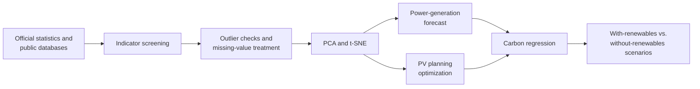

<div align="center">

# Photovoltaic Power Generation

### A multidimensional framework for forecasting, planning optimization, and carbon assessment

[](https://doi.org/10.3389/fenvs.2026.1799258)


[](https://creativecommons.org/licenses/by/4.0/)

**English** · [简体中文](README.zh-CN.md) · [Paper PDF](paper/fenvs-14-1799258.pdf) · [Published article](https://doi.org/10.3389/fenvs.2026.1799258)

</div>

---

This repository accompanies the open-access article **“Research on photovoltaic power generation based on multi-dimensional indicators and models.”** It collects the study’s tabular data and exploratory Python/MATLAB scripts for a linked set of tasks: multidimensional indicator screening, power-supply forecasting, photovoltaic planning optimization, and scenario-based carbon-emissions assessment.

Rather than treating PV development as a single forecasting problem, the paper connects economic, industrial, energy, environmental, population, urbanization, and sustainability indicators in one planning framework. The repository preserves the research artifacts behind that analysis—including preprocessing scripts, descriptive plots, dimensionality-reduction experiments, regression models, and particle-swarm optimization prototypes.

> **Important:** this is a research artifact archive, not a production PV dispatch tool. Long-horizon outputs are scenario-based estimates and depend on the assumptions, statistical definitions, and historical inputs used in the paper.

## Study at a glance

| Component | Purpose | Methods |
|---|---|---|
| Indicator construction | Represent economic, energy, environmental, demographic, and sustainability conditions | Literature screening, frequency/semantic validation |
| Data quality | Diagnose distributions, outliers, and missingness | K–S/Shapiro–Wilk tests, Q–Q plots, box plots, interpolation |
| Feature reduction | Reduce redundancy and multicollinearity | PCA for population/social variables; t-SNE for energy-structure variables |
| Power forecasting | Model nonlinear electricity-production trends | Cubic polynomial regression; blocked five-fold validation |
| PV planning | Search capacity/efficiency/radiation configurations under constraints | Improved Particle Swarm Optimization (PSO) |
| Carbon assessment | Compare carbon trajectories with and without renewable-power growth | Linear and ridge regression; scenario comparison |

## Analytical workflow



## Indicator framework

The final framework contains five primary dimensions:

| Dimension | Representative variables in the repository |
|---|---|
| Economic and industrial | GDP per capita, power-industry investment, high-tech exports |
| Energy consumption and supply | Total electricity production, hydro/thermal/nuclear/wind production, energy-consumption elasticity, electricity-consumption elasticity, total energy use, fuel shares |
| Environmental and emissions | Methane emissions, carbon-dioxide emissions |
| Population and urbanization | Population density, urban share, labor force, population in large urban agglomerations |
| Sustainability | Cultivated-land share and energy-structure/efficiency measures |

The repository also includes a site-oriented PV workbook with wind speed, temperature, irradiance, wind direction, rainfall, panel-temperature probes, active energy/power, maximum wind speed, and pressure.

## Core models

### Standardization and PCA

For feature $j$ and observation $i$:

$$
\tilde{x}_{ij}=\frac{x_{ij}-\mu_j}{s_j}.
$$

After eigendecomposition of the correlation matrix, the retained-component score is

$$
Z_i=\sum_{k=1}^{p}g_k y_{ik},
$$

where $g_k$ is the explained-variance contribution of component $k$ and $y_{ik}$ is its score. The paper retains two principal components for the population/social group; the first two components explain approximately 99.94% of its variance.

### Cubic electricity-production forecast

The time-trend model is

$$
y_t=a+bt+ct^2+dt^3+\varepsilon_t.
$$

The widening 95% prediction interval in the long horizon is a reminder that extrapolation uncertainty grows quickly beyond the observed years.

### PV planning objective and PSO

The scenario optimizer maximizes cumulative generation:

$$
\max E_{\text{total}}=\sum_{r,t} C_{r,t}\,\eta_{r,t}\,R_{r,t}\,H,
$$

subject to investment, operating-cost, budget, grid-capacity, and feasible-range constraints. Here $C$ denotes installed capacity, $\eta$ generation efficiency, $R$ solar radiation, and $H$ effective generation hours.

A standard velocity/position update can be written as

$$
v_i^{t+1}=\omega_t v_i^t+c_1r_1(p_i-x_i^t)+c_2r_2(g-x_i^t),
\qquad
x_i^{t+1}=x_i^t+v_i^{t+1},
$$

with linearly decreasing inertia

$$
\omega_t=\omega_{\mathrm{ini}}-
\frac{t}{T}\left(\omega_{\mathrm{ini}}-\omega_{\mathrm{end}}\right).
$$

### Ridge regression for carbon assessment

To stabilize coefficients under multicollinearity, the study uses

$$
\hat{\boldsymbol\beta}_{\text{ridge}}
=\left(X^{\mathsf T}X+\lambda I\right)^{-1}X^{\mathsf T}y,
$$

which minimizes

$$
J(\boldsymbol\beta)=\sum_{i=1}^{n}(y_i-x_i^{\mathsf T}\boldsymbol\beta)^2
+\lambda\lVert\boldsymbol\beta\rVert_2^2.
$$

### Evaluation metrics

$$
\operatorname{RMSE}=\sqrt{\frac{1}{n}\sum_{i=1}^{n}(y_i-\hat y_i)^2},
$$

$$
\operatorname{MAPE}=\frac{100\%}{n}\sum_{i=1}^{n}\left|\frac{y_i-\hat y_i}{y_i}\right|,
\qquad
R^2=1-\frac{\sum_i(y_i-\hat y_i)^2}{\sum_i(y_i-\bar y)^2}.
$$

## Main findings reported in the paper

- The cubic electricity-production model reports in-sample RMSE of 122.008, MAPE of 2.64%, and $R^2=0.9975$.
- Time-ordered blocked five-fold validation gives RMSE of 168.35, MAPE of 5.56%, and $R^2=0.9236$. The paper correctly treats this as a robustness check—not a strictly forward-only backtest.
- Under the stated 2024–2060 planning assumptions, the PSO solution produces cumulative generation on the order of $4.53\times10^9$ kWh. This value is conditional on capacity-growth, efficiency, radiation, effective-hours, cost, and grid assumptions.
- The ridge carbon model uses $\lambda=0.045$ and reports $R^2=0.951$ and adjusted $R^2=0.930$; total energy consumption remains the statistically significant positive predictor in that specification.
- The article reports that a 1% increase in PV generation could be associated with a 2.05% reduction in China’s power-sector carbon emissions by 2035 under the discussed scenario evidence.
- In the scenario comparison, renewable-energy expansion slows emissions growth after 2020, reaches a peak around 2030, and falls below the no-renewables trajectory around 2050. These are scenario paths, not unconditional forecasts.

## Repository structure

```text
the-data-of-photovoltaic-power-generation/
├── README.md
├── README.zh-CN.md
├── paper/
│   └── fenvs-14-1799258.pdf
├── code of Photovoltaic Power Generation/
│   ├── *.py                         # Python preprocessing, EDA, regression, PSO
│   └── *.m                          # MATLAB preprocessing, PCA/t-SNE, mapping, regression
└── data of Photovoltaic Power Generation/
    ├── README.md
    ├── 初步数据.xlsx                # Broad original indicator table
    ├── 数据预处理后结果.xlsx        # Cleaned/harmonized indicator table
    ├── 导入数据.xlsx                # Model-ready multidimensional features
    ├── 主成分分析数据集.xlsx        # Site/meteorological PCA dataset
    ├── 降维结果.xlsx                # Reduced features
    ├── 总表.xlsx                    # PV capacity, cost, demand, and grid assumptions
    ├── 数据集  基于光伏发电.xlsx     # Carbon, economy, fuel use, and renewable power
    ├── data.xlsx                    # With/without renewable scenario trajectories
    └── ...                          # Intermediate and supporting workbooks
```

## Data catalog

| Workbook | Shape of primary sheet | Role |
|---|---:|---|
| `初步数据.xlsx` | 24 years × 33 columns | Broad source table for electricity, fuels, investment, population, emissions, and land use |
| `数据预处理后结果.xlsx` | 24 years × 25 columns | Cleaned and interpolated modeling table |
| `导入数据.xlsx` | 24 years × 18 columns | Multidimensional feature matrix used by reduction/correlation analyses |
| `主成分分析数据集.xlsx` | 10 regions × 12 columns | Meteorological and operating variables for site-level dimensionality reduction |
| `总表.xlsx` | 30 years × 17 columns | PV capacity, annual additions, costs, radiation, demand, price, and grid capacity |
| `数据集  基于光伏发电.xlsx` | 53 rows × 9 columns | Carbon emissions, GDP, energy/fuel consumption, and renewable-power data |
| `data.xlsx` | 52 rows × 3 columns | Year and carbon trajectories with/without new renewable energy |
| `指标频数.xlsx` | 17 indicators × 3 columns | Literature-derived indicator frequency table |

## Code map

| Task | Representative scripts |
|---|---|
| Preprocessing/interpolation | `水电、火电、核电数据预处理.py`, `风电数据预处理.py`, `电力生产量(亿千瓦小时)数据预处理.py` |
| Distribution checks | `8 q-q图.py`, `9 ks检验代码.m`, box-plot scripts |
| Visualization and correlation | `热力图.py`, `矩阵热力图.m`, `14  相关性分析.m`, `26 散点图矩阵.py` |
| Dimensionality reduction | `12 因子载荷矩阵热力图.m`, `13 tsne降维.m` |
| Forecasting/regression | `15、三次多项式回归预测模型.py`, `15.5 三次多项式回归预测模型.m`, `关系模型的构建.m`, `27 基于光伏发电的线性回归i模型.m` |
| Optimization | `优化 加入 粒子群代码内容.py`, `优化算法一 可实现.py`, `优化二.py` |
| Scenario comparison | `28 结果比对图.m`, `碳排放2027-2055年数据补充 数据预处理.py` |

## Environment and use

### Python

```bash
python -m venv .venv
source .venv/bin/activate
python -m pip install numpy pandas matplotlib scipy scikit-learn seaborn wordcloud pyswarm openpyxl
```

### MATLAB

The `.m` files use functionality from base MATLAB and, depending on the script, Statistics and Machine Learning Toolbox and Mapping Toolbox.

Most scripts are independent research notebooks saved as source files rather than a coordinated package. Before running one:

1. Open the script and update its input/output path variables.
2. Run it from `code of Photovoltaic Power Generation/` or place the referenced workbook beside the script.
3. Confirm that the selected workbook columns match the names expected by that script.
4. Write generated figures/results to a new directory so the released artifacts remain unchanged.

## Reproducibility notes

- Several scripts contain machine-specific Windows paths and must be edited before use.
- File names contain spaces and Chinese characters; quote paths in shell commands.
- The archive mixes Python and MATLAB versions of similar analyses. They are research-stage alternatives, not guaranteed identical implementations.
- Scripts whose file names contain `不太对` (“not quite correct”) are retained for provenance and should be treated as exploratory, not recommended entry points.
- Some input values and long-horizon assumptions are interpolated or scenario-generated. Do not interpret them as observed measurements.
- A single lockfile, end-to-end runner, and automated test suite are not currently included.

## Citation

```bibtex
@article{fan2026photovoltaic,
  title   = {Research on Photovoltaic Power Generation Based on Multi-Dimensional Indicators and Models},
  author  = {Fan, Pengying and Chen, Zhenlin and Wang, Yile},
  journal = {Frontiers in Environmental Science},
  year    = {2026},
  volume  = {14},
  pages   = {1799258},
  doi     = {10.3389/fenvs.2026.1799258}
}
```

## License

The published article and the PDF stored in `paper/` are distributed under [Creative Commons Attribution 4.0](https://creativecommons.org/licenses/by/4.0/). This repository does **not** currently contain a repository-wide license for the code and data; the article’s CC BY license does not automatically license every separate repository artifact. Please contact the authors before redistributing or adapting those materials beyond legally permitted use.
