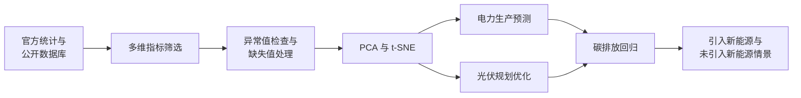

<div align="center">

# 光伏发电多维研究框架

### 电力预测、规划优化与碳排放情景评估

[](https://doi.org/10.3389/fenvs.2026.1799258)


[](https://creativecommons.org/licenses/by/4.0/)

[English](README.md) · **简体中文** · [论文 PDF](paper/fenvs-14-1799258.pdf) · [正式发表页面](https://doi.org/10.3389/fenvs.2026.1799258)

</div>

---

本仓库是开放获取论文 **《Research on photovoltaic power generation based on multi-dimensional indicators and models》** 的配套研究资料库，收录了论文使用的表格数据，以及用于多维指标筛选、电力供应预测、光伏规划优化和碳排放情景评估的 Python/MATLAB 研究脚本。

论文没有把光伏发展简化为单一预测问题，而是将经济与产业、能源、环境、人口与城镇化、可持续性等因素纳入统一的规划框架。仓库保留了相关研究过程产物，包括数据预处理、描述性可视化、降维实验、回归模型和粒子群优化原型。

> **重要说明：** 本项目是研究资料归档，不是生产级光伏调度系统。长期结果属于条件情景估计，依赖论文使用的历史数据、统计口径和模型假设。

## 研究概览

| 模块 | 目的 | 主要方法 |
|---|---|---|
| 指标构建 | 描述经济、能源、环境、人口与可持续性条件 | 文献检索、频数筛选、语义校验 |
| 数据质量 | 诊断分布、异常值与缺失值 | K–S/Shapiro–Wilk、Q–Q 图、箱线图、插值 |
| 特征降维 | 缓解冗余与多重共线性 | 人口社会变量使用 PCA，能源结构变量使用 t-SNE |
| 电力预测 | 拟合电力生产的非线性时间趋势 | 三次多项式回归、分块五折验证 |
| 光伏规划 | 在成本与技术约束下搜索容量、效率和辐射组合 | 改进粒子群优化（PSO） |
| 碳排放评估 | 对比新能源扩张与无新能源情景 | 线性回归、岭回归、情景轨迹比较 |

## 分析流程



## 指标框架

最终指标体系包括五个一级维度：

| 维度 | 仓库中的代表性变量 |
|---|---|
| 经济与产业 | 人均 GDP、电力行业投入、高技术产品出口 |
| 能源消费与供应 | 电力生产总量、水电/火电/核电/风电、能源与电力消费弹性、能源消费总量、各燃料占比 |
| 环境与排放 | 甲烷排放、二氧化碳排放 |
| 人口与城镇化 | 人口密度、城镇人口比重、劳动力、百万人口以上城市群人口 |
| 可持续性 | 耕地占比、能源结构与效率指标 |

仓库还包含一个光伏站点数据表，覆盖风速、气温、辐射度、风向、降雨量、组件温度探针、有功电能/功率、最大风速和气压等变量。

## 核心模型

### 标准化与 PCA

对于第 $i$ 个观测的第 $j$ 个特征：

$$
\tilde{x}_{ij}=\frac{x_{ij}-\mu_j}{s_j}.
$$

对相关系数矩阵进行特征分解后，综合得分为：

$$
Z_i=\sum_{k=1}^{p}g_k y_{ik},
$$

其中 $g_k$ 是第 $k$ 个主成分的方差贡献率，$y_{ik}$ 是对应得分。论文在人口与社会变量组保留两个主成分，累计解释方差约为 99.94%。

### 三次电力生产预测

时间趋势模型为：

$$
y_t=a+bt+ct^2+dt^3+\varepsilon_t.
$$

长期预测的 95% 预测区间随时间明显变宽，因此观测区间之外的不确定性会快速增加。

### 光伏规划目标与 PSO

情景优化以累计发电量最大为目标：

$$
\max E_{\text{total}}=\sum_{r,t} C_{r,t}\,\eta_{r,t}\,R_{r,t}\,H,
$$

同时满足投资、运维成本、预算、电网容量和参数可行域约束。$C$ 表示装机容量，$\eta$ 表示发电效率，$R$ 表示太阳辐射，$H$ 表示有效发电小时数。

PSO 的速度与位置更新可写为：

$$
v_i^{t+1}=\omega_t v_i^t+c_1r_1(p_i-x_i^t)+c_2r_2(g-x_i^t),
\qquad
x_i^{t+1}=x_i^t+v_i^{t+1},
$$

惯性权重线性递减：

$$
\omega_t=\omega_{\mathrm{ini}}-
\frac{t}{T}\left(\omega_{\mathrm{ini}}-\omega_{\mathrm{end}}\right).
$$

### 碳排放岭回归

为缓解多重共线性，论文采用：

$$
\hat{\boldsymbol\beta}_{\text{ridge}}
=\left(X^{\mathsf T}X+\lambda I\right)^{-1}X^{\mathsf T}y,
$$

对应目标函数为：

$$
J(\boldsymbol\beta)=\sum_{i=1}^{n}(y_i-x_i^{\mathsf T}\boldsymbol\beta)^2
+\lambda\lVert\boldsymbol\beta\rVert_2^2.
$$

### 评价指标

$$
\operatorname{RMSE}=\sqrt{\frac{1}{n}\sum_{i=1}^{n}(y_i-\hat y_i)^2},
$$

$$
\operatorname{MAPE}=\frac{100\%}{n}\sum_{i=1}^{n}\left|\frac{y_i-\hat y_i}{y_i}\right|,
\qquad
R^2=1-\frac{\sum_i(y_i-\hat y_i)^2}{\sum_i(y_i-\bar y)^2}.
$$

## 论文主要结果

- 三次电力生产模型的样本内 RMSE 为 122.008、MAPE 为 2.64%、$R^2=0.9975$。
- 按时间顺序分块的五折验证结果为 RMSE 168.35、MAPE 5.56%、$R^2=0.9236$。论文明确将其视为稳健性检验，而不是严格的向前滚动回测。
- 在给定的 2024—2060 年假设下，PSO 方案的累计发电量约为 $4.53\times10^9$ kWh；该值取决于装机增速、效率、辐射、有效小时数、成本和电网约束。
- 碳排放岭回归采用 $\lambda=0.045$，报告 $R^2=0.951$、调整后 $R^2=0.930$；该设定下能源消费总量仍是显著的正向变量。
- 论文报告，在相关情景证据下，到 2035 年光伏发电占比每提高 1%，中国电力部门碳排放可能下降约 2.05%。
- 情景比较显示，新能源扩张使碳排放增速在 2020 年后放缓、约在 2030 年达到峰值，并在 2050 年前后低于“未引入新能源”轨迹。这些是条件情景，不是无条件预测。

## 仓库结构

```text
the-data-of-photovoltaic-power-generation/
├── README.md
├── README.zh-CN.md
├── paper/
│   └── fenvs-14-1799258.pdf
├── code of Photovoltaic Power Generation/
│   ├── *.py                         # Python 预处理、EDA、回归与 PSO
│   └── *.m                          # MATLAB 预处理、PCA/t-SNE、地图与回归
└── data of Photovoltaic Power Generation/
    ├── README.md
    ├── 初步数据.xlsx                # 宽表原始指标
    ├── 数据预处理后结果.xlsx        # 清洗与统一口径后的数据
    ├── 导入数据.xlsx                # 多维模型特征
    ├── 主成分分析数据集.xlsx        # 站点气象/运行 PCA 数据
    ├── 降维结果.xlsx                # 降维输出
    ├── 总表.xlsx                    # 光伏容量、成本、需求与电网假设
    ├── 数据集  基于光伏发电.xlsx     # 碳排放、经济、燃料与新能源电力
    ├── data.xlsx                    # 有/无新能源的情景轨迹
    └── ...                          # 中间及辅助工作簿
```

## 数据目录

| 工作簿 | 主工作表规模 | 用途 |
|---|---:|---|
| `初步数据.xlsx` | 24 年 × 33 列 | 电力、燃料、投入、人口、排放和土地利用的宽表 |
| `数据预处理后结果.xlsx` | 24 年 × 25 列 | 清洗、插值后的建模表 |
| `导入数据.xlsx` | 24 年 × 18 列 | 降维与相关性分析使用的多维特征矩阵 |
| `主成分分析数据集.xlsx` | 10 个地区 × 12 列 | 站点气象和运行变量 |
| `总表.xlsx` | 30 年 × 17 列 | 装机、年度新增、成本、辐射、需求、电价与电网容量 |
| `数据集  基于光伏发电.xlsx` | 53 行 × 9 列 | 碳排放、GDP、能源/燃料消费与新能源电力 |
| `data.xlsx` | 52 行 × 3 列 | 年份及有/无新能源两类碳排放轨迹 |
| `指标频数.xlsx` | 17 个指标 × 3 列 | 文献指标频数统计 |

## 代码索引

| 任务 | 代表性脚本 |
|---|---|
| 预处理与插值 | `水电、火电、核电数据预处理.py`、`风电数据预处理.py`、`电力生产量(亿千瓦小时)数据预处理.py` |
| 分布检验 | `8 q-q图.py`、`9 ks检验代码.m`、箱线图脚本 |
| 可视化与相关性 | `热力图.py`、`矩阵热力图.m`、`14  相关性分析.m`、`26 散点图矩阵.py` |
| 降维 | `12 因子载荷矩阵热力图.m`、`13 tsne降维.m` |
| 预测与回归 | `15、三次多项式回归预测模型.py`、`15.5 三次多项式回归预测模型.m`、`关系模型的构建.m`、`27 基于光伏发电的线性回归i模型.m` |
| 优化 | `优化 加入 粒子群代码内容.py`、`优化算法一 可实现.py`、`优化二.py` |
| 情景比较 | `28 结果比对图.m`、`碳排放2027-2055年数据补充 数据预处理.py` |

## 环境与运行

### Python

```bash
python -m venv .venv
source .venv/bin/activate
python -m pip install numpy pandas matplotlib scipy scikit-learn seaborn wordcloud pyswarm openpyxl
```

### MATLAB

`.m` 文件使用 MATLAB 基础功能；部分脚本还需要 Statistics and Machine Learning Toolbox 与 Mapping Toolbox。

多数脚本是相互独立的研究过程文件，并非统一 Python 包。运行前请：

1. 打开脚本并修改输入/输出路径。
2. 在 `code of Photovoltaic Power Generation/` 下运行，或把对应工作簿放在脚本旁。
3. 确认选用工作簿的列名与脚本预期一致。
4. 将新生成的图形和结果写入新目录，避免覆盖已发布产物。

## 可复现注意事项

- 部分脚本包含本机 Windows 绝对路径，必须修改后才能运行。
- 文件名包含空格和中文；在 Shell 中使用时请给路径加引号。
- 仓库同时保留 Python 与 MATLAB 的相似分析版本，它们属于研究阶段备选实现，不保证逐项完全一致。
- 文件名含 `不太对` 的脚本为溯源保留的探索版本，不建议作为正式入口。
- 部分输入和长期假设来自插值或情景生成，不能解释为直接观测值。
- 仓库目前没有统一锁定文件、端到端运行器或自动化测试。

## 引用方式

```bibtex
@article{fan2026photovoltaic,
  title   = {Research on Photovoltaic Power Generation Based on Multi-Dimensional Indicators and Models},
  author  = {Fan, Pengying and Chen, Zhenlin and Wang, Yile},
  journal = {Frontiers in Environmental Science},
  year    = {2026},
  volume  = {14},
  pages   = {1799258},
  doi     = {10.3389/fenvs.2026.1799258}
}
```

## 许可

正式论文及 `paper/` 中的 PDF 按 [Creative Commons Attribution 4.0](https://creativecommons.org/licenses/by/4.0/) 发布。仓库当前 **没有** 覆盖全部代码和数据的统一许可文件；论文的 CC BY 许可不会自动扩展到所有独立的仓库资料。若需在法定使用范围之外重新分发或改编，请先联系作者。
